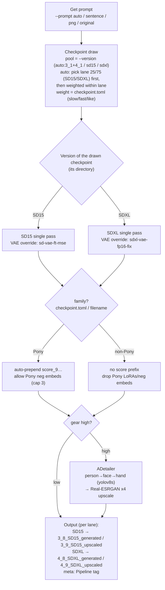

# ComfyUI Portrait Image Generation Environment

A ComfyUI-based portrait image generation environment.

[日本語はこちら](README_ja.md)

GeForce/Quadro 16GB VRAM recommended.
Works on CPU + 16GB RAM as well (slower).

## Console language

Console output (logs, progress, `--help`) is available in English and Japanese.
The language is chosen from the `PLAYGROUND_LANG` environment variable (`en` / `ja`);
if unset, it is auto-detected from the OS locale (Japanese locale → `ja`, otherwise `en`).

``` powershell
$env:PLAYGROUND_LANG = "en"   # force English
$env:PLAYGROUND_LANG = "ja"   # force Japanese
```

Image metadata (the PNG `parameters` chunk, e.g. the `Pipeline:` field) is always written in English regardless of this setting.

## Setup

### Windows

``` powershell
cd ~
git clone https://github.com/AZO234/comfyui_playground
python -m venv .venv
.\.venv\Scripts\Activate.ps1
# Install PyTorch matching your environment first (pick one)
#pip install --index-url https://download.pytorch.org/whl/cpu  torch torchvision
pip install --index-url https://download.pytorch.org/whl/cu128 torch torchvision
# Remaining dependencies
pip install -r requirements.txt
# ComfyUI
git clone https://github.com/comfyanonymous/ComfyUI
cd ComfyUI\custom_nodes
git clone https://github.com/ltdrdata/ComfyUI-Impact-Pack
git clone https://github.com/ltdrdata/ComfyUI-Impact-Subpack
cd ../..
pip install -r ComfyUI\requirements.txt
pip install -r ComfyUI\custom_nodes\ComfyUI-Impact-Pack\requirements.txt
pip install -r ComfyUI\custom_nodes\ComfyUI-Impact-Subpack\requirements.txt
```

### Linux/macOS

``` bash
$ cd ~
$ git clone https://github.com/AZO234/comfyui_playground
$ python -m venv .venv
$ source .venv/bin/activate
# Install PyTorch matching your environment first (pick one)
#$ pip install --index-url https://download.pytorch.org/whl/cpu  torch torchvision
$ pip install --index-url https://download.pytorch.org/whl/cu128 torch torchvision
# Remaining dependencies
$ pip install -r requirements.txt
# ComfyUI
$ git clone https://github.com/comfyanonymous/ComfyUI
$ cd ComfyUI/custom_nodes
$ git clone https://github.com/ltdrdata/ComfyUI-Impact-Pack
$ git clone https://github.com/ltdrdata/ComfyUI-Impact-Subpack
$ cd ../..
$ pip install -r ComfyUI/requirements.txt
$ pip install -r ComfyUI/custom_nodes/ComfyUI-Impact-Pack/requirements.txt
$ pip install -r ComfyUI/custom_nodes/ComfyUI-Impact-Subpack/requirements.txt
```

## Directory Layout

- `./` : Scripts and configuration files
- `1_0_prompts` : Place PNG images (with embedded metadata) used as prompts
- `2_0_tensors` : Drop unclassified tensors here (intake tray)
- `2_1_errortensors` : Invalid / broken / duplicate tensors
- `2_2_lowtensors` : Manual quarantine for tensors you judge bad by eye (no color, buggy output, etc.) — excluded from both scanning and generation
- `2_3_hightensors` : Manual quarantine for tensors out of scope — different architecture (AuraFlow / Flux / SD3 etc.) or simply too heavy for the current SDXL/SD15 pipeline — excluded from both scanning and generation
- `3_1_SD15_checkpoint` : SD15 checkpoint tensors (rough / high-volume lane)
- `3_2_SD15_LoRA` : SD15 LoRA tensors
- `3_3_SD15_Embedding` : SD15 embedding tensors
- `3_8_SD15_generated` : Generated PNGs from SD15 checkpoints (with metadata) are written here
- `3_9_SD15_upscaled` : Upscaled SD15 PNGs (with metadata) are written here
- `4_1_SDXL_checkpoint` : SDXL checkpoint tensors (production lane)
- `4_2_SDXL_LoRA` : SDXL LoRA tensors
- `4_3_SDXL_ControlNet` : SDXL ControlNet tensors
- `4_4_SDXL_Embedding` : SDXL embedding tensors
- `4_8_SDXL_generated` : Generated PNGs from SDXL checkpoints (with metadata) are written here
- `4_9_SDXL_upscaled` : Upscaled SDXL PNGs (with metadata) are written here

Tensors are auto-sorted by `tensors.py` into the SD15 (`3_x`) or SDXL (`4_x`) lane
based on the model architecture detected from each file.

## Quickstart

1. Put checkpoint tensors into `2_0_tensors`.

2. Run the tensor-sorting script `dist_tensors.py`.

```
python dist_tensors.py
```

3. Generate images.

```
python generate.py --sentence "a girl walking with umbrella in outside"
```

Standard images are written to `4_8_SDXL_generated`,
upscaled images to `4_9_SDXL_upscaled`.


## Generation Flow (Overview)

A single image from `generate.py` roughly follows the flow below (terms are detailed later).



In words, the key points are:

- **Checkpoints are drawn lane-aware**: in `--version auto` the lane (SD15 / SDXL) is picked first at **25/75** probability, then a checkpoint is drawn weighted within that lane by `checkpoint.toml` fast/slow/like. With `--version sdxl` or `--version sd15` the lane is forced.
- **Both SD15 and SDXL render in a single pass** (the old SD15 draft → SDXL clean two-stage chain was retired on 2026-06-13). Output PNGs and upscaled PNGs are written to lane-specific directories.
- **Each lane uses a stable external VAE** auto-downloaded on first run (SDXL → `madebyollin/sdxl-vae-fp16-fix`, SD15 → `stabilityai/sd-vae-ft-mse-original`) — bundled checkpoint VAEs are bypassed to avoid color shift / fp16 overflow artifacts.
- **`family` gating is applied uniformly** (CLI and GUI share the same `prepare_workflow_prompt` helper): Pony checkpoints get the score prefix + capped Pony neg embeds; non-Pony bases drop Pony LoRAs and Pony neg embeds.
- **`--gear high`** runs ADetailer (`face_yolov8s` / `hand_yolov8s` / `person_yolov8s-seg`) and Real-ESRGAN x4 upscaling.

(This diagram renders as-is on GitHub. It is Mermaid, so just edit this block when the behavior changes.)

## Prompt Config: prompt.toml

Defines the keywords used to build prompts.
Emphasis syntax is supported: `*word*` (1.1x), `**word**` (1.3x), `***word***` (1.5x).

- `who` — Who is in the scene
  - The notation "someone wearing X doing Y at Z" is also valid (later fields can be omitted)

`["**a girl**", false, false, false, false, ""],`
`["**a school wear girl**", true, false, false, false, "school wear"],`
`["**a school wear girl running**", true, true, false, false, "school wear"],`
`["**2 girls kissing**", true, true, false, true, "kiss"],`

  - The first three booleans flag whether the entry already contains the wearing / doing / location (true) or should draw them from the section below (false)
  - The fourth boolean (`many`) marks a multi-person entry (e.g. "2 women"). When true, the image is generated on a landscape canvas (`--many-width` × `--many-height`, default 1216×832) to reduce fusion between figures
  - Backward compatible: a 5-element entry without `many` (a string at index 4) is treated as `many=false`
  - LoRA keywords (last field) are described later

- `wearing` — What is being worn

Converted to `wearing X`. (`""` or `"nothing"` becomes `naked`.)

`["dress", 10, "dress"],`

  - Each entry has a weight (weight / total) and an optional LoRA keyword.

- `with_items` — Accessories or contextual items

Converted to `with X`. (`""` or `"nothing"` becomes empty.)

`["earring", 10, "jewel"],`

  - Each entry has a weight and an optional LoRA keyword.

- `motion` — Actions or poses

`["sitting", 50, ""],`
`["standing", 50, ""],`

  - Each entry has a weight and an optional LoRA keyword.


## Scripts

### PNG Prompt Utility: pngutil.py

```
python pngutil.py <PNG file>
```

- Default (no flag)
Inspect the prompt text and LoRA keywords (described below) embedded in the PNG.

- `--sentence`

Replace the embedded prompt text.

- `--lora`

Replace the embedded LoRA keywords.

- `--erase`

Strip all text metadata from the PNG.

#### Recommended PNG metadata viewer

[stable-diffusion-prompt-reader](https://github.com/receyuki/stable-diffusion-prompt-reader) works well.

### Tensor Triage and Check: tensors.py

```
python tensors.py
```

Sorts the tensors in `2_0_tensors` into the appropriate directories.
A hash check is performed; when an identical tensor already exists, the newest one is kept and the older copy is removed.
Hash information is written to `tensors.toml`. New LoRA entries are appended to `LoRA_keywords.toml` with `keyword` initialised to `""`.

`tensors.toml` groups entries by tensor filename:
- `hash` : Hash value

`LoRA_keywords.toml` groups entries by LoRA filename:
- `keyword` : LoRA keyword

`SDXL_LoRA.toml` records the subject of each SDXL LoRA (`4_2_SDXL_LoRA`); `tensors.py` appends entries automatically with `subject` initialised to empty.
- `subject` : `object` / `accessory` / `ware` / `facial` / `pose`, etc., filled in by you.
  - Only **`subject="pose"`** is functionally meaningful. **When OpenPose is in use, pose LoRAs are automatically excluded** (letting OpenPose and a LoRA fight over the pose breaks the image).
  - The `# hint:` at the end of each line is an auto-generated hint derived from the filename (a clue for "is this an object? an accessory?"); it is regenerated every time and need not be edited. Your `subject` values are preserved.

### Generation: generate.py

```
python generate.py
```

Generates images continuously.
`tensors.py` is run first.

PNGs with embedded metadata, named `YYYYMMDDHHMMSS.png`, are written to `4_8_SDXL_generated` and `4_9_SDXL_upscaled`.

After each image, there is a cooldown interval of (device temperature − 50) seconds.

If the checkpoint used is not listed in `checkpoint.toml`, an entry is appended (see below).


Press Ctrl+C to stop.

#### Prompt (input source)

The input source determines the mode automatically (you do not need to pass `--prompt` explicitly).

- No flag (`--prompt auto`, default) : Build prompt text and LoRA keywords from `prompt.toml` and generate continuously. No reference image.
- `--sentence "<text>" [--lora-keywords "kw,..."]` : Generate continuously from the supplied text + LoRA keywords (see below). No reference image.
- `--png <PNG file>` : **Quality-up refine.** Repaint the *image* of that PNG with SDXL img2img, lifting it from SD15-grade toward SDXL-grade quality (**stops after one image**, see below).
- `--png-sentence <PNG file>` : Generate continuously from the *prompt text* embedded in the PNG (the image itself is not used). The unified draw routes SD15 → two-stage or SDXL → single pass.
- `--prompt original --png-sentence <PNG file>` : Reuse the checkpoint, LoRAs, and prompt text from the PNG metadata.

**Note (behavior change):** the old `--png` meant "read text from a PNG and generate anew", but the roles have changed to
**`--png` = image refine / `--png-sentence` = text generation**. For the text use case, use `--png-sentence`.

##### Quality-up refine (`--png`)

A one-shot mode that lifts older SD15 images (and the like) toward SDXL-grade quality.

- The given PNG's image is used as the init for **SDXL img2img** repainting. The checkpoint is drawn from the SDXL-only pool (or `--checkpoint`), with family handling (Pony → score prefix / Pony neg).
- LoRAs are drawn from the SDXL LoRAs using the PNG's LoRA keywords (or `--lora-keywords`).
- `--refine-denoise <0.0–1.0>` : img2img denoise (default 0.5; low = faithful to the original / high = SDXL repaints more aggressively).
- The resolution is scaled to roughly 1MP (SDXL-native) while preserving the original PNG's aspect ratio. `--gear high` adds ADetailer + upscaling; `--gear low` does refine only.
- Output goes to `4_8_SDXL_generated` / `4_9_SDXL_upscaled`, and the `Pipeline` metadata records `refine (src:…, denoise…)`. **Generates one image and exits.**

##### Checkpoint selection

`--checkpoint <checkpoint name>` : Pin a specific checkpoint.

The draw pool is determined by `--version` (see below). By default (`auto`) the draw is from a single pool that
merges SD15 + SDXL, and the drawn version automatically decides single-stage vs. two-stage.

Within the pool,
the first run picks a checkpoint **not** in `checkpoint.toml` at random,
and subsequent runs pick from the listed checkpoints (see below) with probability 2/3 and from the unlisted ones with 1/3.

For listed checkpoints, the weight is
((max `slow` in `checkpoint.toml` × 2) − (`fast` + `slow`)) / 2 + `like`.

##### checkpoint.toml

`checkpoint.toml` stores supplementary information per checkpoint:
- `slow` : Maximum observed generation time per image (s)
- `fast` : Minimum observed generation time per image (s)
- `like` : User preference, positive or negative
- `inference` : Extra inference steps to add, positive or negative
- `style` : `"anime"`, `"real"`, `"mix"`, or `""` (used to pick the ControlNet / upscaling model)
- `family` : Lineage `"pony"` / `"illustrious"` / `"real"` / `""` (used for Pony handling; see "Lineage-aware handling" below)

When `--gear high` finishes generating an image, if the checkpoint is not yet listed,
an entry is added with `slow` = `fast` = measured time (s), `like = 0`, `inference = 0`, `style = ""`,
and `family =` a guess from the filename (pony/pdxl/pny → pony, etc.; `""` when undecidable).
`family` can be wrong, so fix it by eye (Illustrious-family models in particular are hard to tell from the filename).

##### Lineage-aware handling (family-aware neg / score)

Because lineage (Pony / Illustrious) cannot be told from metadata, it is held in the `family` field of `checkpoint.toml`.
Based on the drawn checkpoint's `family` (or its filename when absent), the SDXL stage automatically:

- **Pony** → prepends `score_9, score_8_up, …` to the front of the positive prompt, and allows Pony neg embeddings (**up to 3**, to curb over-negation).
- **non-Pony** → **automatically excludes** Pony-only neg embeddings (names containing `pony` / `pdxl` / `pny`), because applying them to non-Pony models breaks colors and suppresses the subject. General-purpose neg embeddings are used regardless of lineage.
- No Pony-related additions are made to the SD15 draft stage.

##### LoRA keywords and selection

LoRA keywords are a playground-specific convention.
They are a word list used purely to pick LoRAs, separate from the prompt text.

Matching is case-insensitive: whitespace = AND, commas = OR.

Decide the number of LoRAs (default 1–3) →
pick LoRA keywords (no duplicates) →
with 90% probability match the keyword against each LoRA's filename, embedded metadata, and the `keyword` field in `LoRA_keywords.toml`, &
with 10% probability pick from all LoRAs + "none".

Use `lora_chance_ui.py` to inspect which LoRAs are likely to be picked for a given prompt or keyword set.

LoRA keywords are also appended to the prompt text with weight `(0.8 / number_of_keywords) × keyword`.

#### Gear

`--gear low` : Rough generation. Single pass, 30 inference steps, no ADetailer, no LoRA, no ControlNet, no upscaling.
`--gear high` : Production generation. 50 inference steps, ADetailer on, LoRA selection, ControlNet selection, upscaling on. Single pass for both SD15 and SDXL.

`--gear high` is the default.

You do not need to think about SD15 vs. SDXL; just choose "rough (low)" or "finish (high)". Both versions render in a single pass (the old SD15 draft → SDXL clean two-stage chain was retired on 2026-06-13).

#### Architecture

`--arch cuda` : Use CUDA + VRAM
`--arch cpu` : Use CPU + RAM

`--arch cuda` is the default.

#### Version (checkpoint draw pool)

`--version` narrows the checkpoint draw pool; both SD15 and SDXL render in a single pass.

`--version auto` : Treat SD15 (`3_1`) + SDXL (`4_1`) as a merged pool. **The lane is drawn first at 25/75 (SD15/SDXL)** and the checkpoint is then drawn weighted within that lane by `checkpoint.toml` (default).
`--version sdxl` : Draw only from `4_1` SDXL.
`--version sd15` : Draw only from `3_1` SD15.

`--version auto` is the default.

The within-lane weight reads `checkpoint.toml` separately for SD15 and SDXL, so the fast/slow scale difference between lanes no longer biases the draw (this was a known bug in the cross-lane `max_slow` weighting before 2026-06-13). The 25/75 SDXL-heavy split exists because the VAE override + single-pass unification made SDXL the everyday choice. Change `SD15_LANE_PROB` in `pick_checkpoint` to adjust.

Resolution defaults follow the version (SD15 = 512 / SDXL = 1024; landscape `many` is SD15 = 768×512 / SDXL = 1216×832).
Override with `--width` / `--height` / `--many-width` / `--many-height`.

The route taken is visible in the `path:` line of the run log and the `Pipeline:` field of the output PNG metadata
(e.g. `Pipeline: SDXL single-pass` / `Pipeline: SD15 single-pass`).

#### LoRA

`--lora prompt` : Use LoRAs picked from the prompt
`--lora manual <lora name, ...>` : Pin specific LoRAs
`--lora keyword <word, ...>` : Pick LoRAs based on the given keywords

`--lora prompt` is the default.

#### ControlNet
`--controlnet <controlnet name>` : Pin a specific ControlNet.

By default the ControlNet is chosen based on the `style` field in `checkpoint.toml`:
- `anime` → ControlNets whose filename contains `anime`
- `real` → ControlNets whose filename contains `real`

One is picked at random from the matching set.
For `mix` or empty, the pick is uniformly random.

The source-image routing is also selected correctly from the ControlNet filename
(e.g. `canny` → canny edge extraction, `tile` → pass the source image through unchanged).

#### Visualizing the workflow (debug)

Dump the ComfyUI API workflow (node graph) that `generate.py` builds to a JSON file.
**Drag and drop** the resulting JSON onto the blank canvas of the ComfyUI WebUI (http://127.0.0.1:8188)
and it expands into a node graph with automatic layout, letting you see the workflow the code actually built.

`--dump-workflow` : Also save each submitted workflow to `workflow_dump/<timestamp>_<kind>.json` (**generation still runs as usual**). For refine, `refine` is written.
`--dump-only` : Only dump the workflow JSON; **do not** submit it to ComfyUI (inspect the graph without using the GPU). Writes one single-pass workflow and exits immediately (refine is disabled).

```
# Dump one SDXL single-pass graph without using the GPU
python generate.py --dump-only --version sdxl
# Adding --gear low drops ADetailer/upscale, giving the minimal graph (txt2img + LoRA) that is easiest to read
```

Kinds are `sdxl_single` / `sd15_single` / `refine`. `workflow_dump/` is gitignored.

### Tensor Info Viewer: tensors_view.py

```
python tensors_view.py [--dir <directory>] [--list]
```

A Tkinter viewer that reads `safetensors` headers raw and lists metadata, tensor counts, dtypes, and file size. No torch dependency (header scanning only).

- When `--dir` is omitted, the first directory in `[tensors_dirs].list` of `preview_settings.toml` is opened.
- The directory combo on the toolbar switches between the candidates from `[tensors_dirs].list` and reloads immediately.
- Search / kind / base filters and sorting are available. The "+meta" toggle extends search to metadata text.
- If a sidecar preview (`<name>.preview.png`, produced by `make_previews.py`) exists, it is shown in the top-right pane. Click the preview to open a full-size view (click or Esc to close).
- Selecting a LoRA row opens the "Preview settings" editor on the right: edit the category (`ware` / `doing1-3` / `doingmob` / `object` / `part` / `view` / `place` / `artstyle` / `unknown`, ...) and an optional custom prompt. Multi-selection batch-sets the category. SD15 vs. SDXL routing is detected per row automatically.
- "Regenerate" launches `make_previews.py --files` in a subprocess to re-render sidecars only for the selected tensors.
- "Gen thumbs" batch-renders sidecars for every tensor that does not yet have one.
- Pass `--list` to skip the GUI and print the listing to the terminal instead.

#### Settings file: preview_settings.toml

Shared between the viewer and `make_previews.py`.

- `[tensors_dirs]` : An ordered list (`list = [...]`) of candidate directories the viewer switches between. The first entry is the default when `--dir` is omitted.
- `[LoRA_preview_template]` : The minimal prompt scaffold per LoRA category.
- `[checkpoint_preview_template]` : Scaffold for checkpoint previews (`default` is the generic key; add `pony` and other family keys to switch per family).

#### Sidecar metadata: LoRA_preview.toml

Per-LoRA category and custom-prompt overrides, split between SD15 and SDXL (so that stems that collide between the two versions stay disambiguated):

- `[SD15_categories]` / `[SDXL_categories]` : `stem = "<category>"`
- `[SD15_prompts]` / `[SDXL_prompts]` : `stem = "<custom positive>"` (LoRAs without an entry are rendered with the category scaffold alone)

The audit performed at `tensors.py` startup auto-appends new LoRAs as `ware` and warns about stale entries whose source file no longer exists (manual category edits are preserved — nothing is deleted automatically). Run `python make_previews.py --init-categories` to fully reconcile the file.

### Image Generation GUI: generate_gui.py

```
python generate_gui.py
```

A Tkinter-based manual image generation GUI that reuses `generate.py`'s internals. Generates 1–300 images in a batch while streaming results into an inline gallery.

#### Main window

- **Checkpoint**: combobox showing 3_1_SD15_checkpoint and 4_1_SDXL_checkpoint tagged `[SD15] / [SDXL]`. The thumbnail (`<name>.preview.png` sidecar produced by `make_previews.py`) is shown alongside; click for full-size modal
- **LoRA**: filtered automatically by the checkpoint's version (3_2 or 4_2). Standard Ctrl/Shift-click multi-select (EXTENDED mode). Selected items are echoed as a thumbnail strip below (each thumbnail click opens the full-size modal)
- **ControlNet / Embedding**: two side-by-side lists. ControlNet is SDXL-only (4_3, single-select). Embedding switches per version (3_3 or 4_4, multi-select). Selected embeddings are auto-prepended to the negative prompt as `embedding:<stem>` (ComfyUI native syntax)
- **Prompt**: multi-line text area (supports compel emphasis `*word*` / `**word**` / `***word***`)
- **Count / OpenPose / Settings… button / Generate / Stop**: single control row. "Count" 1-300 = number of images (each iteration gets a fresh random seed). OpenPose is auto-disabled when SD15 is picked (ControlNet 4_3 is SDXL-only)
- **Gallery** (bottom): thumbnails are appended as each image completes. **Click** opens a full-size modal; **right-click** brings up "Delete" / "Upscale (Anime / Real)"
- **Mouse wheel**: scrolls the gallery vertically

#### Settings dialog

Opened via "Settings…" on the main window. Values are persisted to `generate_gui.toml` (written on Generate, on dialog close, on app close; loaded at startup).

- **Prompts**: positive / negative (multi-line)
- **Generation params**: CFG / Steps / Seed (`-1` = random; an integer uses `seed+i` for batch variation) / Width / Height / Sampler (10 options including dpmpp_2m) / Scheduler (6 options including karras) / LoRA total weight (distributed equally across `n`, default 0.8)
- **Quality boosts**: AD detailer (face / person / hand) / Hires Fix / Hires Scale / Hires Denoise / Hires Steps

#### Upscaling (right-click)

Right-click on a gallery thumbnail → "Upscale (Real-ESRGAN x4)" → choose **Anime (default)** or **Real**. `_upscale_worker` submits a standalone upscale workflow to ComfyUI and saves the result to `4_9_SDXL_upscaled/<original_name>.png`. The models (`RealESRGAN_x4plus_anime_6B.pth` / `RealESRGAN_x4plus.pth`) are auto-downloaded by `ensure_upscale_model` from the official xinntao GitHub releases when missing.

#### Auto-prepared dependencies

- `extra_model_paths.yaml` is regenerated (registers the 3_x / 4_x model directories with ComfyUI)
- The first generation of a session force-restarts ComfyUI (avoids the case where a stale server hasn't loaded the YAML)
- ADetailer YOLO weights (face / hand / person) are auto-downloaded from HuggingFace
- Real-ESRGAN upscaling models are auto-downloaded from GitHub releases

### Image Gallery: gallery.py

```
python gallery.py [--list]
```

A Tkinter thumbnail gallery for generated PNGs. **Read-only** — no copy / no delete (guards against accidental writes).

- Recursively scans four fixed directories: `3_8_SD15_generated` / `3_9_SD15_upscaled` / `4_8_SDXL_generated` / `4_9_SDXL_upscaled`
- Reads A1111-compatible metadata (parameters chunk) and shows thumbnails + metadata. SD15 / SDXL is color-coded based on the `Pipeline` field (falling back to `Size`)
- Toggle between Icon view and List view (click column headers to sort; row thumbnail size is adjustable 24–128 px via slider)
- Search (AND substring across name/model/loras/keywords/positive/pipeline) plus arch filter
- Right pane: large preview + full params + positive/negative + "Open" (launches the OS image viewer)
- `--list` prints the metadata list to stdout without the GUI

Delete / copy operations are intentionally absent — use `generate_gui.py`'s right-click gallery menu or your file explorer.

### LoRA Selection Probability: lora_chance_ui.py

```
python lora_chance_ui.py
```

Runs 300 draws and prints the Top 30 LoRA selection probabilities as a bar chart.

- `random` : Each draw picks `prompt.toml` entries randomly
- `manual` : Each draw uses entries chosen interactively from `prompt.toml`
- `lora_keyword` : Each draw uses the LoRA keywords you type

## Auto-placement of face_yolov8s.pt, hand_yolov8s.pt, person_yolov8s-seg.pt

The following detection models are downloaded and placed automatically if missing:
- `ComfyUI/models/ultralytics/bbox/face_yolov8s.pt`
- `ComfyUI/models/ultralytics/bbox/hand_yolov8s.pt`
- `ComfyUI/models/ultralytics/segm/person_yolov8s-seg.pt`

## License

GPL-3.0
