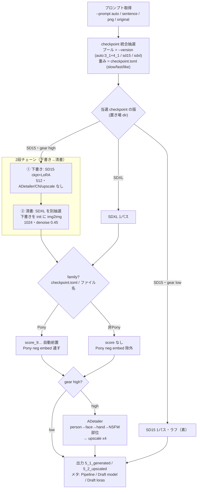

# ComfyUI 人物画像生成環境

ComfyUIの人物画像制作環境です。

GeForce/Quadro 16GB VRAM推奨。
遅いが、CPU+16GB RAMでも動作する。

## コンソール言語

コンソール出力（ログ・進捗・`--help`）は英語／日本語に対応。
言語は環境変数 `PLAYGROUND_LANG`（`en` / `ja`）で選ぶ。未設定なら OS ロケールから自動判定（日本語環境→`ja`、その他→`en`）。

``` powershell
$env:PLAYGROUND_LANG = "en"   # 英語に固定
$env:PLAYGROUND_LANG = "ja"   # 日本語に固定
```

画像メタデータ（PNG の `parameters` チャンク、例 `Pipeline:` フィールド）は、この設定に関わらず**常に英語**で書き出される。

## 初期設定

### Windows

``` powershell
cd ~
git clone https://github.com/AZO234/comfyui_playground
python -m venv .venv
.\.venv\Scripts\Activate.ps1
# PyTorch を環境に合わせて先に入れる（いずれか）
#pip install --index-url https://download.pytorch.org/whl/cpu  torch torchvision
pip install --index-url https://download.pytorch.org/whl/cu128 torch torchvision
# 残りの依存
pip install -r requirements.txt
# ComfyUI
git clone https://github.com/comfyanonymous/ComfyUI
cd ComfyUI\custom_nodes
git clone https://github.com/ltdrdata/ComfyUI-Impact-Pack
git clone https://github.com/ltdrdata/ComfyUI-Impact-Subpack
cd ../..
pip install -r ComfyUI\requirements.txt
pip install -r ComfyUI\custom_nodes\ComfyUI-Impact-Pack\requirements.txt
pip install -r ComfyUI\custom_nodes\ComfyUI-Impact-Subpack\requirements.txt
```

### Linux/macOS

``` bash
$ cd ~
$ git clone https://github.com/AZO234/comfyui_playground
$ python -m venv .venv
$ source .venv/bin/activate
# PyTorch を環境に合わせて先に入れる（いずれか）
#$ pip install --index-url https://download.pytorch.org/whl/cpu  torch torchvision
$ pip install --index-url https://download.pytorch.org/whl/cu128 torch torchvision
# 残りの依存
$ pip install -r requirements.txt
# ComfyUI
$ git clone https://github.com/comfyanonymous/ComfyUI
$ cd ComfyUI\custom_nodes
$ git clone https://github.com/ltdrdata/ComfyUI-Impact-Pack
$ git clone https://github.com/ltdrdata/ComfyUI-Impact-Subpack
$ cd ../.. 
$ pip install -r ComfyUI\requirements.txt
$ pip install -r ComfyUI\custom_nodes\ComfyUI-Impact-Pack\requirements.txt
$ pip install -r ComfyUI\custom_nodes\ComfyUI-Impact-Subpack\requirements.txt
```

## ディレクトリ構成

- `./` : スクリプト・設定ファイル
- `1_0_prompts` ： プロンプトの PNG画像（メタ入り） をユーザが配置する
- `2_0_tensors` ： 種別不明なテンソルをユーザーが配置する（受入トレー）
- `2_1_errortensors` ： 不正 / 破損 / 重複テンソル
- `2_2_lowtensors` ： 発色しない・バグ画になる等、目視でダメと判断したテンソルの手動隔離（scan も生成も対象外）
- `2_3_hightensors` ： 手に余るテンソルの手動隔離 — 別アーキ（AuraFlow / Flux / SD3 等）や現行 SDXL/SD15 パイプラインで扱えない重量級（scan も生成も対象外）
- `3_1_SD15_checkpoint` ： SD15 checkpoint テンソル（ラフ / 量産レーン）
- `3_2_SD15_LoRA` ： SD15 LoRA テンソル
- `3_3_SD15_Embedding` ： SD15 Embedding テンソル
- `3_9_SD15_rough` ： 2段チェーンの SD15 下書き（清書前のラフ）が出力される
- `4_1_SDXL_checkpoint` ： SDXL checkpoint テンソル（本番レーン）
- `4_2_SDXL_LoRA` ： SDXL LoRA テンソル
- `4_3_SDXL_ControlNet` ： SDXL ControlNet テンソル
- `4_4_SDXL_Embedding` ： SDXL Embedding テンソル
- `5_1_generated` ： 生成された PNG画像（メタ入り） が出力される
- `5_2_upscaled` ： アップスケールされた PNG画像（メタ入り） が出力される

テンソルは `tensors.py` が各ファイルの判定アーキテクチャに応じて
SD15 (`3_x`) / SDXL (`4_x`) レーンへ自動振り分けする。

## 一番簡単な使い方

1. チェックポイントテンソルを `2_0_tensors` にいれる。

2. テンソル振り分けスクリプト `dist_tensors.py` を実行する。

```
python dist_tensors.py
```

3. 画像生成を実行する。

```
python generate.py --sentence "a girl walking with umbrella in outside"
```

`5_1_generated` に通常画像、  
`5_2_upscaled` にアップスケール画像が生成されます。


## 生成フロー（概念図）

`generate.py` 1 枚の生成は、おおむね次の流れで進む（用語の詳細は後述）。



要点だけ言葉にすると:

- **checkpoint を 1 プールで抽選**し、**当選した版（SD15/SDXL）と `--gear` で経路が決まる**。
- **SD15 が当選 + `--gear high`** のときだけ **2 段チェーン**（SD15 下書き → SDXL 清書）になる。それ以外は 1 パス。
- **SDXL 段では `family` を見て**、Pony なら score 前置 + Pony neg、非 Pony なら除外。
- **`--gear high`** で ADetailer（person→face→hand→部位）と upscale が走る。

（GitHub 上ではこの図がそのままレンダリングされる。Mermaid 記法なので、仕様変更時はこのブロックを直せばよい。）

## プロンプト設定ファイル prompt.toml

プロンプトを生成するキーワードを記述する。
重み記法あり。 '*～*'（1.1倍）、'**～**'（1.3倍）、'***～***'（1.5倍）。

- who だれが
  - 「どこであれを着た誰かがなにをしている」という記法も可能（後の要素を飛ばせる）

`["**a girl**", false, false, false, false, ""],`
`["**a school wear girl**", true, false, false, false, "school wear"],`
`["**a school wear girl running**", true, true, false, false, "school wear"],`
`["**2 girls kissing**", true, true, false, true, "kiss"],`

  - 1〜3個目のbool（着ているもの・している事・場所）は、キャラ文字列に含んでいればtrue、抽選にする場合はfalse
  - 4個目のbool（many）は、複数人エントリ（"2 women"等）ならtrue。trueのとき横長キャンバス（`--many-width` × `--many-height`、既定 1216×832）で生成し、人物どうしの融合を抑える
  - 後方互換: many を省いた5要素（index4が文字列）は many=false 扱い
  - LoRAキーワードは後述

- wearing 着ているもの

「wearing ～」に変換される。（""や"nothing"は、"naked"に変換）

`["dress", 10, "dress"],`

  - 抽選の重み（重み/総重み）とLoRAキーワードを記載。

- with_items 装飾品・状況

「with ～」に変換される。（""や"nothing"は、空文字に変換）

`["earring", 10, "jewel"],`

  - 抽選の重みとLoRAキーワードを記載。

- motion している事・動作

`["sitting", 50, ""],`
`["standing", 50, ""],`

  - 抽選の重みとLoRAキーワードを記載。


## スクリプト

### PNGプロンプト ユーティリティ pngutil.py

```
python pngutil.py <PNG file>
```

- 確認
規定。PNG画像ファイル内にある文章プロンプト・LoRAキーワード（後述）を確認。

- `--sentence`

PNG画像ファイル内にある文章プロンプトを変更。

- `--lora`

PNG画像ファイル内にあるLoRAキーワードを変更。

- `--erase`

PNG画像ファイル内のテキスト情報を削除。

#### プロンプト入りPNGビューア

[stable-diffusion-prompt-reader](https://github.com/receyuki/stable-diffusion-prompt-reader) が使いやすい。

### テンソル振り分け＆チェック tensors.py

```
python tensors.py
```

`2_0_tensors` ディレクトリにあるテンソルを振り分ける。
ハッシュチェックを行い、すでに同内容のテンソルがある場合は、時刻の新しいテンソルを残す。古い方は削除。
格納ハッシュ情報を `tensors.toml` に記載する。`LoRA_keywords.toml` に初期値 `keyword`は`""` として追記。

`tensors.toml` には、テンソルファイル名をグループ名とした値がある。
`hash` ： ハッシュ値

`LoRA_keywords.toml` には、LoRAテンソルファイル名をグループ名とした値がある。
`keyword` ： LoRAキーワード

`SDXL_LoRA.toml` には、SDXL LoRA（`4_2_SDXL_LoRA`）の種別を記述する（tensors.py が自動追記、`subject` 空で初期化）。
- `subject` ： `object` / `accessory` / `ware` / `facial` / `pose` など、ユーザが記入する。
  - 機能的に意味を持つのは **`subject="pose"`** のみ。**OpenPose 使用時に pose 系 LoRA は自動除外**される（姿勢を OpenPose と LoRA で取り合うと破綻するため）。
  - 各行末の `# hint:` はファイル名由来の自動ヒント（「これは物？アクセサリ？」の手がかり、毎回再生成・編集不要）。`subject` の記入値は保持される。

### 生成 generate.py

```
python generate.py
```

画像を連続で生成する。
生成前に、tensors.py が実行される。

メタ情報入り画像 `YYYYMMDDHHMMSS.png` が `5_1_generated`・`5_2_upscaled` ディレクトリに出力される。  

画像生成後、(デバイス温度-50)秒、冷却インターバル。  

使用したチェックポイントが `checkpoint.toml` に無ければ追記。（後述）


Ctrl+Cで終了。

#### プロンプト（入力ソース）

入力ソースを渡すと mode が自動で決まる（`--prompt` を明示しなくてよい）。

- 指定なし（`--prompt auto` 規定）： prompt.toml からプロンプト文章・LoRAキーワードを生成して連続生成。読出画像なし。
- `--sentence "<文章>" [--lora-keywords "kw,..."]` ： 文章 + LoRAキーワード（後述）で連続生成。読出画像なし。
- `--png <PNG file>` ： **画質アップ refine**。その PNG の『画像』を SDXL img2img で描き直し、SD15→SDXL 画質へ引き上げる（**1 枚で終了**、後述）。
- `--png-sentence <PNG file>` ： PNG の埋込プロンプト『文章』で連続生成（画像は使わない）。統合抽選で SD15→2段 or SDXL→1段。
- `--prompt original --png-sentence <PNG file>` ： PNG メタの checkpoint・LoRA・プロンプト文章を全部流用して生成。

**注意（挙動変更）**: 以前の `--png` は「PNG から文章を読んで新規生成」だったが、現在は
**`--png`=画像 refine / `--png-sentence`=文章生成** に役割が変わった。文章用途は `--png-sentence` を使う。

##### 画質アップ refine（`--png`）

過去の SD15 画像などを SDXL 画質へ引き上げる単発モード。

- 指定 PNG の画像を init に **SDXL の img2img** で描き直す。checkpoint は SDXL 専用プールから抽選（or `--checkpoint`）、family 連動（Pony なら score 前置 / Pony neg）。
- LoRA は PNG の LoRAキーワード（or `--lora-keywords`）から SDXL LoRA を抽選。
- `--refine-denoise <0.0〜1.0>` ： img2img の denoise（既定 0.5。低=元に忠実 / 高=SDXL が大きく描き直す）。
- 解像度は元 PNG のアスペクトを保って約 1MP（SDXL ネイティブ）にスケール。`--gear high` で ADetailer + アップスケール、`--gear low` は refine のみ。
- 出力は `5_1_generated` / `5_2_upscaled`、メタの `Pipeline` に `refine (src:…, denoise…)` を記録。**1 枚生成して終了**。

##### チェックポイント抽選方式

`--checkpoint <checkpoint name>` ： チェックポイントを指定する。

抽選の対象（プール）は `--version`（後述）で決まる。既定（`auto`）では SD15 + SDXL を統合した
1プールから抽選し、当選した版で 1段 / 2段が自動的に決まる。

プール内では、
１度めは `checkpoint.toml` にないチェックポイントをランダムに使用し、
２度め以降は、2/3は `checkpoint.toml`（後述） にあるもの、1/3はないものを抽選する。

`checkpoint.toml` にあるものからは、
((`checkpoint.toml`内の`slow`最大時間*2)-(`fast`+`slow`))/2+`like` を重みとして、抽選する。

##### checkpoint.toml

`checkpoint.toml` には、チェックポイントの補足情報を記述する
- `slow` ： １枚の生成にかかった最大時間(s)
- `fast` ： １枚の生成にかかった最小時間(s)
- `like` ： 好み、正負値
- `inference` ： 追加する推論ステップ数、正負値
- `style` ： "anime" or "real" or "mix" or ""（ControlNet・アップスケールモデル選択に使用）
- `family` ： 系統 "pony" / "illustrious" / "real" / ""（Pony 制御に使用、後述「系統対応」）

`--gear high`にて、画像が生成されたあと、
チェックポイント名とするグループ名がなければ、
`slow` = `fast` = 実測値(s)、`like = 0`、`inference = 0`、`style = ""`、
`family =` ファイル名からの推定値（pony/pdxl/pny→pony 等、判定不能は ""）、で追記する。
`family` は外れることがあるので、目視で直す（特に Illustrious 系はファイル名から判別しにくい）。

##### 系統対応（family-aware なネガ/score）

メタからは系統（Pony / Illustrious）が判別できないため、`checkpoint.toml` の `family` で持つ。
当選 checkpoint の `family`（無ければファイル名）を見て、SDXL 段で自動的に:

- **Pony** → `score_9, score_8_up, …` を positive 先頭に自動前置、Pony 用 neg embedding を許可（ただし **3 個まで**、過剰ネガ抑制）。
- **非 Pony** → Pony 専用 neg embedding（名前に `pony`/`pdxl`/`pny`）を**自動除外**（非 Pony に当てると色崩壊・主体消失するため）。汎用 neg embedding は系統問わず使う。
- SD15 下書き段には Pony 系を一切付けない。

##### LoRAキーワード・抽選方式

LoRAキーワードは独自規格。
文章とは別に、LoRAを抽選するワード列である。

大小文字の区別なしで、スペース区切りはAND、コンマ区切りはOR、で検索。

LoRA数決定 （規定は1～3） →
LoRAキーワード抽選（重複なし） →
90％の確率で、LoRAキーワードで、LoRAのファイル名・メタ情報・`LoRA_keywords.toml`の`keyword`を検索 ＆
10％の確率で、全LoRA+なし から検索

プロンプトの組み合わせやLoRAキーワードで、どのLoRAが抽選されるかを、
`lora_chance_ui.py` で確認可能。

LoRAキーワードは、(0.8/LoRAキーワード数)*LoRAキーワード、という重みでプロンプト文章に加えられる。

#### ギア

`--gear low` ： ラフ生成。1パス・推論数30・ADetailer無し・LoRA無し・ControlNet無し・アップスケールなし。当選 checkpoint が SD15 でも 1パス（下書き確認用）。
`--gear high` ： 本番生成。推論数50・ADetailerあり・LoRA抽選・ControlNet抽選・アップスケールあり。**当選した checkpoint の版で 2通りに分岐する**：
- **SDXL 当選** → そのまま SDXL 1パスで仕上げる。
- **SD15 当選** → SD15 で下書きを描き、その絵を SDXL が img2img で清書する 2段処理（後述「2段チェーン」）。

`--gear high` が規定。

SD15・SDXL を意識する必要はなく、「ラフ（low）か仕上げ（high）か」だけ指定すればよい。
仕上げで SD15 が当選すれば自動的に「SD15 下書き → SDXL 清書」になる。

#### アーキテクチャ

`--arch cuda` ： CUDA+VRAM を使用
`--arch cpu` ： CPU+RAM を使用

`--arch cuda` が規定。

#### バージョン（checkpoint 抽選プール）

`--version` は checkpoint の抽選プールを絞り込むだけで、生成レーンを固定するものではない。
当選した checkpoint の版（置き場ディレクトリ）で 1段 / 2段が自動的に決まる。

`--version auto` ： SD15（`3_1`）+ SDXL（`4_1`）を統合した 1プールから `checkpoint.toml` の重みで抽選（既定）。
`--version sdxl` ： `4_1` SDXL のみを抽選。
`--version sd15` ： `3_1` SD15 のみを抽選。

`--version auto` が規定。

統合プールの重みは SD15 / SDXL を区別せず `checkpoint.toml` の値をそのまま使う。
SD15 は生成が速く重みが高くなりやすいので、偏りを抑えたい場合は `like` で手動調整する。

##### 2段チェーン（SD15 下書き → SDXL 清書）

`--gear high` で **SD15 checkpoint が当選**したときに起動する 2段パイプライン。
SD15 の膨大な LoRA 資産でラフを量産し、SDXL の画力で仕上げる「下書き → 清書」運用。

1. **下書き**：当選した SD15 checkpoint + SD15 LoRA で生成（512、ADetailer / ControlNet / アップスケール無しの素のラフ）。
2. **清書**：下書きを ComfyUI に渡し、別途抽選した **SDXL** checkpoint + SDXL LoRA で img2img 再描画（1024、ADetailer / アップスケール適用）。

`--chain-denoise <0.0〜1.0>` ： 清書 img2img の denoise（既定 0.45）。低いほど下書きの構図・色を保持し、高いほど SDXL が大きく描き直す。
`--save-draft` / `--no-save-draft` ： 中間の SD15 下書きを `3_9_SD15_rough` に保存（**既定 ON**、`--no-save-draft` で OFF）。

解像度の既定は版に追従する（SD15=512 / SDXL=1024、横長 many は SD15=768×512 / SDXL=1216×832）。
`--width` / `--height` / `--many-width` / `--many-height` で上書き可能。

どの経路を通ったかは、実行ログの `path:` 行と、出力 PNG のメタ情報 `Pipeline:` フィールドで確認できる
（メタは英語で統一。例: `Pipeline: SD15→SDXL 2-stage (draft: … / clean: …, denoise 0.45)` / `Pipeline: SDXL single-pass`）。

#### LoRA

`--lora prompt` ： プロンプトにあるLoRAを使用
`--lora manual <lora name, ...>` ： LoRAを指定する 
`--lora keyword <word, ...>` ： キーワードを素にLoRAを抽選する

`--lora prompt` が規定。

#### ControlNet
`--controlnet <controlnet name>` ： ControlNetを指定する。

ControlNetは、既定では、`checkpoint.toml` の `style` が、
`anime` であれば ControlNetファイル名にanimeとあるもの、
`real` であれば ControlNetファイル名にrealとあるもの、
の中からランダムに１つ抽選される。
`mix`や空文字の場合はランダムに抽選する。

また、ControlNetのファイル名から、ソース画像ルーティングを正しく選択する。
(canny → canny edge 抽出、tile → 元画像そのまま、等)

#### workflow の可視化（デバッグ）

`generate.py` が組み立てる ComfyUI の API workflow（ノードグラフ）を JSON に書き出す。
出力 JSON を ComfyUI WebUI（http://127.0.0.1:8188）の黒いキャンバスに**ドラッグ＆ドロップ**すると、
自動レイアウトでノードグラフに展開され、「コードが実際に組んだ workflow」を絵で確認できる。

`--dump-workflow` ： 投入する workflow を `workflow_dump/<時刻>_<種別>.json` にも保存する（**生成は通常通り実行**）。2段チェーンでは下書き（`draft_sd15`）と清書（`chain_clean`）の両方、refine では `refine` も書き出す。
`--dump-only` ： workflow JSON を吐くだけで ComfyUI へは**投入しない**（GPU を使わずグラフだけ確認）。1 枚分の単一パス workflow を書き出して即終了する（chain / refine は無効化）。

```
# GPU を使わず、SDXL 単一パスのグラフを 1 個吐く
python generate.py --dump-only --version sdxl
# --gear low を足すと ADetailer/upscale が外れて最小グラフ（txt2img + LoRA）になり構造が読みやすい
```

種別は `sdxl_single` / `sd15_single` / `chain_clean` / `draft_sd15` / `refine`。`workflow_dump/` は `.gitignore` 済み。

### テンソル情報ビューア tensors_view.py

```
python tensors_view.py [--dir <directory>] [--list]
```

`safetensors` のヘッダを生読みしてメタ情報・テンソル数・dtype・サイズを一覧表示する Tkinter 製のビューア。torch 非依存（ヘッダのみ走査）。

- `--dir` を省略すると `preview_settings.toml` の `[tensors_dirs].list` の先頭ディレクトリを開く。
- ツールバーのディレクトリ選択コンボで `[tensors_dirs].list` の候補を切り替えて即再読込。
- 検索・種別/Base フィルタ・並べ替えに対応。検索の「メタ込み」でメタデータ本文も対象になる。
- サイドカープレビュー（`<name>.preview.png`、`make_previews.py` が生成）があれば右上に表示。プレビュー画像をクリックすると原寸ビューが開く（クリック / Esc で閉じる）。
- LoRA 行を選ぶと右の「プレビュー設定」エディタでカテゴリ（`ware` / `doing1-3` / `doingmob` / `object` / `part` / `view` / `place` / `artstyle` / `unknown` …）とカスタムプロンプトを編集できる。複数行選択で一括カテゴリ設定も可能。SD15 / SDXL の振り分けは行ごとに自動判定。
- 「再生成」で `make_previews.py --files` をサブプロセスで呼び、選択したテンソルだけサイドカーを焼き直す。
- 「サムネイル生成」でサイドカー未生成のテンソルを一括で焼く。
- `--list` を付けると GUI を起動せず、ターミナルに一覧を出力する。

#### 設定ファイル preview_settings.toml

ビューア / `make_previews.py` の共有設定。

- `[tensors_dirs]` ： ビューアが切り替える候補ディレクトリの順序付きリスト（`list = [...]`）。先頭が `--dir` 省略時の既定。
- `[LoRA_preview_template]` ： LoRA プレビューのカテゴリごとの最小プロンプト雛形。
- `[checkpoint_preview_template]` ： checkpoint プレビューの雛形（`default` キーが汎用、`pony` などの family キーを足すと family 別に切替）。

#### サイドカー実体 LoRA_preview.toml

LoRA ごとのカテゴリとカスタムプロンプトは SD15 / SDXL に分けて格納される（同名 stem の衝突を避けるため）。

- `[SD15_categories]` / `[SDXL_categories]` ： `stem = "<category>"`
- `[SD15_prompts]` / `[SDXL_prompts]` ： `stem = "<custom positive>"`（書かれていない LoRA は category の雛形のみで焼かれる）

`tensors.py` の起動時監査が新規 LoRA を `ware` で自動追記、実体の無い余剰エントリは警告で表示する（手編集の category を守るため自動削除はしない）。完全に整理したいときは `python make_previews.py --init-categories` を実行する。

### 画像生成 GUI generate_gui.py

```
python generate_gui.py
```

`generate.py` の中身を流用したマニュアル指定型の画像生成 GUI（Tkinter）。1〜300 枚をまとめて生成しつつ、ギャラリーに即時表示する。

#### メイン画面

- **チェックポイント**：3_1_SD15_checkpoint と 4_1_SDXL_checkpoint を `[SD15] / [SDXL]` タグ付き combobox で選択。サムネ（`<name>.preview.png` サイドカー、`make_previews.py` 生成）を横に表示。クリックで原寸モーダル
- **LoRA**：チェックポイント版に応じて 3_2 / 4_2 を自動フィルタ。Ctrl/Shift クリックの複数選択（標準 EXTENDED モード）。選択分のサムネを下段に列表示（各サムネクリックで原寸モーダル）
- **ControlNet / Embedding**：横並び 2 列リスト。ControlNet は SDXL のみ（4_3、単一選択）。Embedding は版で切替（3_3 or 4_4、複数選択）。Embedding は negative プロンプトの先頭に `embedding:<stem>` として自動連結（ComfyUI ネイティブ構文）
- **プロンプト**：複数行テキストエリア（`*word*` / `**word**` / `***word***` の compel 重み記法対応）
- **推論数 / OpenPose / 設定… ボタン / 画像生成 / 停止**：1 行コントロール。`推論数 1-300` = 生成枚数（各回 seed ランダム）。SD15 選択時は OpenPose 自動無効化（ControlNet 4_3 は SDXL のみのため）
- **ギャラリー**（下段）：生成完了するたびにサムネ追加。**クリックで原寸モーダル**、**右クリックメニュー**で「削除」「アップスケール（アニメ / 実写）」
- **マウスホイール**：ギャラリーを縦スクロール

#### 設定ダイアログ

メイン画面の「設定…」ボタンで開く。値は `generate_gui.toml` に永続化（生成ボタン押下時、ダイアログ閉じ時、アプリ終了時に書き出し、起動時に読み戻し）。

- **プロンプト**：ポジティブ / ネガティブ（複数行）
- **生成パラメータ**：CFG / Steps / Seed（`-1`=ランダム、整数指定で `seed+i` 連番） / 幅 / 高さ / Sampler（dpmpp_2m など 10 種） / Scheduler（karras など 6 種） / LoRA 合計強度（n 個に均等配分、既定 0.8）
- **品質補正**：AD 補正（FaceDetailer/PersonDetailer/HandDetailer の有無） / Hires Fix / Hires Scale / Hires Denoise / Hires Steps

#### アップスケール（右クリック）

ギャラリー上で右クリック → 「アップスケール（Real-ESRGAN x4）」→ **アニメ（既定）** または **実写** を選択。`_upscale_worker` が ComfyUI に upscale 専用 workflow を投入し、`5_2_upscaled/<元名>.png` に保存。モデル（`RealESRGAN_x4plus_anime_6B.pth` / `RealESRGAN_x4plus.pth`）は無ければ公式 GitHub release から `ensure_upscale_model` が自動 DL。

#### 自動化される下準備

- `extra_model_paths.yaml` の自動生成（3_x / 4_x の model dir を ComfyUI に登録）
- セッション初回は ComfyUI 強制再起動（古いサーバが YAML 未読のままになるのを防ぐ）
- ADetailer YOLO 重み（face / hand / person）の HF 自動 DL
- アップスケールモデルの GitHub release 自動 DL

### 画像ギャラリー gallery.py

```
python gallery.py [--list]
```

生成済み PNG をサムネイル一覧する Tkinter ビューア。**閲覧専用**（コピー・削除なし、誤操作防止）。

- 固定 3 ディレクトリを再帰走査： `3_9_SD15_rough` / `5_1_generated` / `5_2_upscaled`
- A1111 互換メタ（parameters chunk）を読んでサムネ + メタ一覧表示。`Pipeline` フィールド優先で SD15 / SDXL を色分け（無ければ Size で補完）
- アイコン view / リスト view を切替（列ヘッダクリックでソート、行サムネはスライダーで 24-128 px 可変）
- 検索（name/model/loras/keywords/positive/pipeline の AND 部分一致）+ アーキフィルタ
- 右パネル：大プレビュー + 全 params + positive/negative + 「開く」（OS ビューアで開く）
- `--list`：GUI なしでメタ一覧を標準出力

画像の削除・コピーは `generate_gui.py` のギャラリー右クリックメニューかエクスプローラから行う。

### LoRA選択確率確認 lora_chance_ui.py

```
python lora_chance_ui.py
```

300回の抽選で選択されるLoRAの確率Top30を、グラフ表示。

- `random` ： prompt.toml の語句をランダムに選択した場合
- `manual` ： prompt.toml の語句をユーザが選択した場合
- `lora_keyword` ： 入力したlora_keywordの場合

## face_yolov8n.pt、hand_yolov8n.pt、person_yolov8n-seg.pt 自動配置

以下の補正ファイルは無ければ自動でダウンロードして配置されます。
- `ComfyUI/models/ultralytics/bbox/face_yolov8n.pt`
- `ComfyUI/models/ultralytics/bbox/hand_yolov8n.pt`
- `ComfyUI/models/ultralytics/segm/person_yolov8n-seg.pt`

## ライセンス

GPL-3.0
